

  

  
  
  
  

Full-stack developer at **Brunata** in Denmark, mostly Kotlin, Java, Angular and TypeScript, and happiest doing the platform and tooling work that makes a whole team faster. On the side I run **[Gnist Studio](https://gniststudio.com)** and ship my own apps, plugins and small tools, usually because I wanted them myself first.

 

<picture>
  <source media="(prefers-color-scheme: dark)" srcset="assets/section-featured-dark.svg">
  
</picture>

  <a href="https://github.com/Nicsilver/LGPower"></a>

  
  

 

<picture>
  <source media="(prefers-color-scheme: dark)" srcset="assets/section-shipped-dark.svg">
  
</picture>

  <a href="https://github.com/Nicsilver/flutster"></a>
  <a href="https://github.com/Nicsilver/roam"></a>
  <a href="https://github.com/Nicsilver/PCIO"></a>
  <a href="https://github.com/Nicsilver/glimt"></a>
  <a href="https://github.com/Nicsilver/Jumper"></a>
  <a href="https://github.com/Nicsilver/claude-sessions"></a>

 

<picture>
  <source media="(prefers-color-scheme: dark)" srcset="assets/section-stack-dark.svg">
  
</picture>

  

 

<picture>
  <source media="(prefers-color-scheme: dark)" srcset="assets/section-activity-dark.svg">
  
</picture>

<picture>
  <source media="(prefers-color-scheme: dark)" srcset="https://raw.githubusercontent.com/Nicsilver/Nicsilver/output/snake-dark.svg">
  
</picture>
